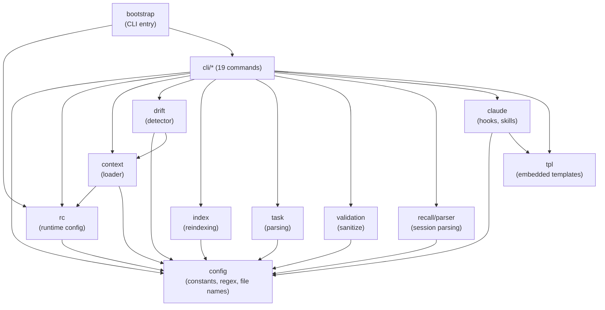
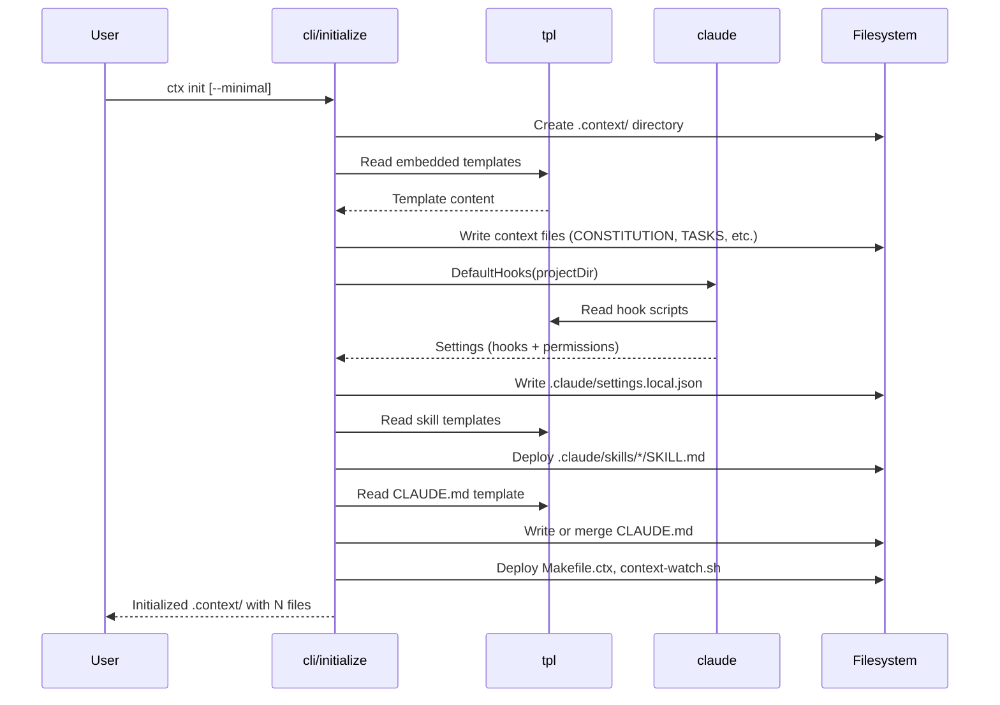
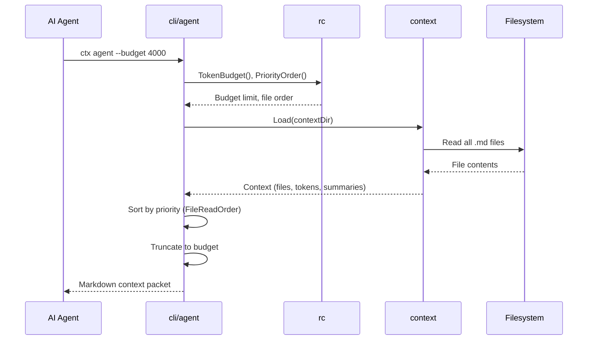
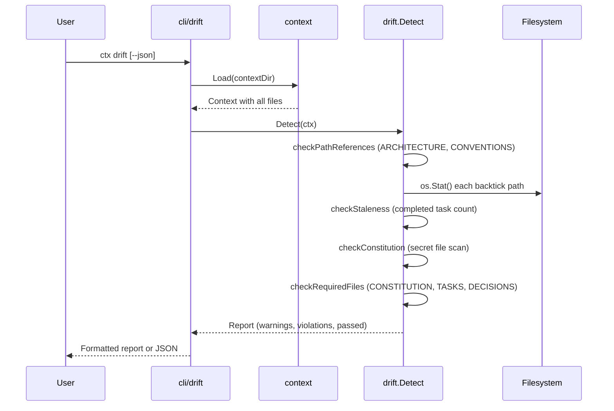
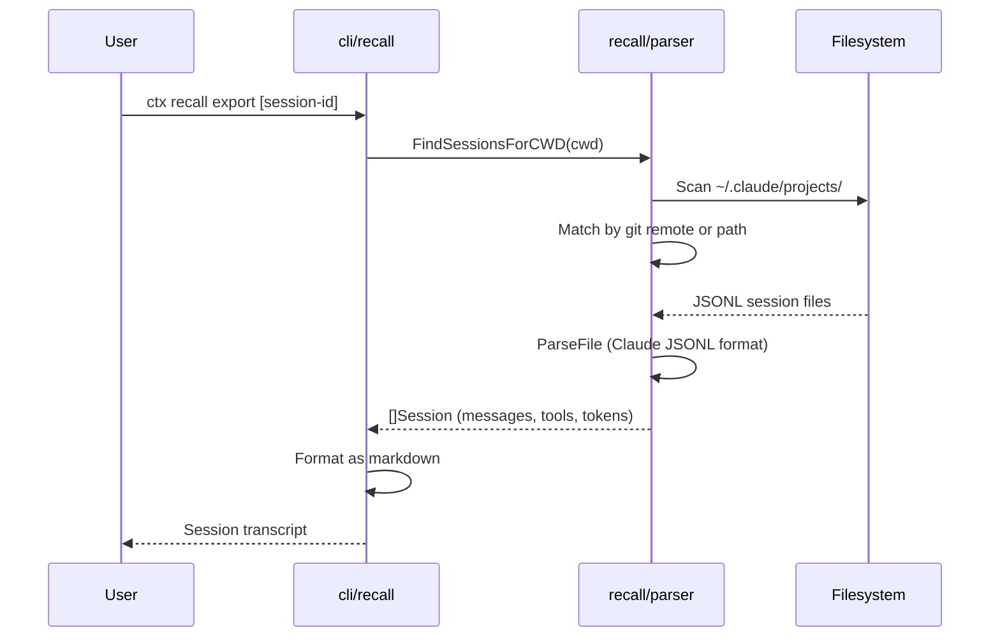
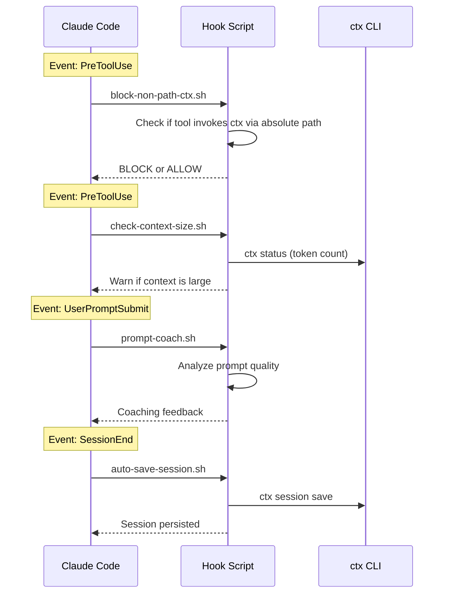
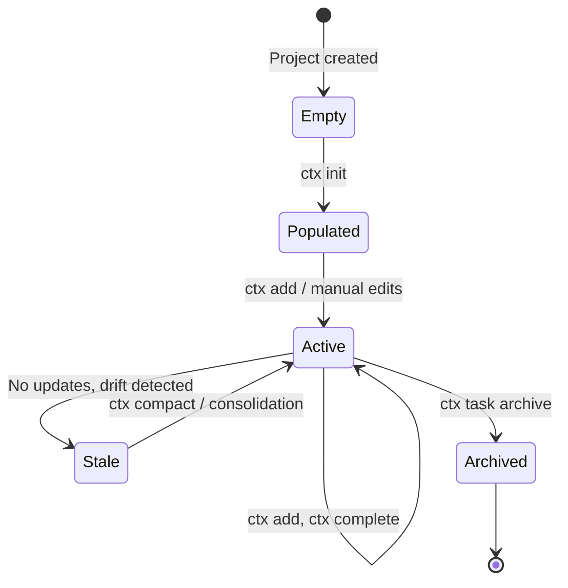

# Architecture

## Overview

ctx is a CLI tool that creates and manages a `.context/` directory
containing structured markdown files. These files provide persistent,
token-budgeted, priority-ordered context for AI coding assistants
across sessions.

Design philosophy:

- **Markdown-centric**: all context is plain markdown; no databases,
  no proprietary formats. Files are human-readable and version-
  controlled alongside the code they describe.
- **Token-budgeted**: context assembly respects configurable token
  limits so AI agents receive the most important information first
  without exceeding their context window.
- **Priority-ordered**: files are loaded in a deliberate sequence
  (rules before tasks, conventions before architecture) so agents
  internalize constraints before acting.
- **Convention over configuration**: sensible defaults with optional
  `.contextrc` overrides. No config file required to get started.

## Package Dependency Graph



`config` and `tpl` are the two foundation packages with zero internal
dependencies. Everything else builds upward from them.

## Component Map

### Foundation Packages

| Package           | Purpose                                                                                                                                                                          | Depends On |
|-------------------|----------------------------------------------------------------------------------------------------------------------------------------------------------------------------------|------------|
| `internal/config` | Constants, regex patterns, file names, read order, permissions (9 files covering config, file names, directories, entries, headings, markers, patterns, regex, token formatting) | (none)     |
| `internal/tpl`    | Embedded templates via go:embed; provides access to all `.context/` scaffolds, skill definitions, hook scripts, and tools                                                        | (none)     |

### Core Packages

| Package                  | Purpose                                                                                                                                       | Depends On                            |
|--------------------------|-----------------------------------------------------------------------------------------------------------------------------------------------|---------------------------------------|
| `internal/rc`            | Runtime configuration from `.contextrc`, env vars, and CLI flags; singleton with sync.Once caching                                            | `internal/config`                     |
| `internal/context`       | Load `.context/` directory: read .md files, estimate tokens, generate summaries, detect empty files                                           | `internal/rc`, `internal/config`      |
| `internal/drift`         | Detect stale or invalid context: dead path references, completed-task buildup, potential secrets, missing required files                      | `internal/config`, `internal/context` |
| `internal/index`         | Generate and update markdown index tables in DECISIONS.md and LEARNINGS.md                                                                    | `internal/config`                     |
| `internal/task`          | Parse task checkboxes in TASKS.md; match state, indentation, content                                                                          | `internal/config`                     |
| `internal/validation`    | Input sanitization (filenames)                                                                                                                | `internal/config`                     |
| `internal/recall/parser` | Parse AI session transcripts (JSONL) into structured data; extensible parser registry supporting Claude Code (and designed for Aider, Cursor) | `internal/config`                     |
| `internal/claude`        | Generate Claude Code integration: hooks, skills, settings, permissions                                                                        | `internal/config`, `internal/tpl`     |

### Entry Point

| Package              | Purpose                                                                     | Depends On                                   |
|----------------------|-----------------------------------------------------------------------------|----------------------------------------------|
| `internal/bootstrap` | Create root Cobra command, register global flags, attach all 19 subcommands | `internal/rc`, all `internal/cli/*` packages |

### CLI Commands (`internal/cli/*`)

| Command      | Purpose                                                                         | Key Dependencies                                                     |
|--------------|---------------------------------------------------------------------------------|----------------------------------------------------------------------|
| `add`        | Append entries to context files (decisions, tasks, learnings, conventions)      | `config`, `rc`, `index`, `initialize`                                |
| `agent`      | Generate AI-ready context packets with token budgeting                          | `config`, `rc`, `context`, `task`, `initialize`                      |
| `compact`    | Archive completed tasks, clean up context files                                 | `config`, `rc`, `context`, `task`, `add`, `complete`, `initialize`   |
| `complete`   | Mark tasks as done in TASKS.md                                                  | `config`, `rc`, `task`, `add`, `initialize`                          |
| `decision`   | Manage DECISIONS.md (add, list, reindex)                                        | `config`, `rc`, `index`                                              |
| `drift`      | Detect stale/invalid context and report issues                                  | `config`, `rc`, `context`, `drift`, `task`, `tpl`, `initialize`      |
| `hook`       | Generate AI tool integration configs (Claude, Cursor, Aider, Copilot, Windsurf) | (Cobra only)                                                         |
| `initialize` | Create `.context/` directory, deploy templates, generate hooks, merge settings  | `config`, `rc`, `claude`, `tpl`                                      |
| `journal`    | Export and synthesize sessions; generate static site                            | `config`, `rc`                                                       |
| `learnings`  | Manage LEARNINGS.md (add, list, reindex)                                        | `config`, `rc`, `index`                                              |
| `load`       | Output assembled context in read order with token budgeting                     | `config`, `rc`, `context`, `initialize`                              |
| `loop`       | Generate Ralph loop scripts for iterative AI workflows                          | `config`                                                             |
| `recall`     | Browse AI session history (list, show, export)                                  | `config`, `rc`, `recall/parser`                                      |
| `serve`      | Serve static journal site locally                                               | `rc`                                                                 |
| `session`    | Manage session snapshots (save, list, load, parse)                              | `config`, `rc`, `validation`, `initialize`                           |
| `status`     | Show context summary: file list, tokens, summaries                              | `config`, `rc`, `context`, `initialize`                              |
| `sync`       | Sync project files with context; detect deps, suggest updates                   | `config`, `context`, `initialize`                                    |
| `task`       | Task management utilities; archive completed tasks                              | `config`, `rc`, `task`, `validation`, `add`, `compact`, `initialize` |
| `watch`      | Monitor stdin for context updates; auto-save sessions                           | `config`, `rc`, `context`, `task`, `add`, `initialize`               |

## Data Flow

### 1. `ctx init` -- Initialization



### 2. `ctx agent` -- Context Packet Assembly



### 3. `ctx drift` -- Drift Detection



### 4. `ctx recall export` -- Session Export



### 5. Hook Lifecycle



## Context File Lifecycle



## Key Architectural Patterns

### Priority-Based File Ordering

Files load in a deliberate sequence defined by `config.FileReadOrder`:

1. CONSTITUTION (rules the agent must not violate)
2. TASKS (what to work on now)
3. CONVENTIONS (how to write code)
4. ARCHITECTURE (system structure)
5. DECISIONS (why things are this way)
6. LEARNINGS (gotchas and tips)
7. GLOSSARY (domain terms)
8. AGENT_PLAYBOOK (how to use this system)

Overridable via `priority_order` in `.contextrc`.

### Token Budgeting

Token estimation uses a 4-characters-per-token heuristic
(see the context package). When the total context exceeds the
budget (default 8000, configurable via `CTX_TOKEN_BUDGET` or
`.contextrc`), lower-priority files are truncated or omitted.
Higher-priority files always get included first.

### Structured Entry Headers

Decisions and learnings use timestamped headers for chronological
ordering and index generation:

```
## [2026-01-28-143022] Use PostgreSQL for primary database
```

The regex `config.RegExEntryHeader` parses these across the codebase.

### Runtime Config Hierarchy

Configuration resolution (highest priority wins):

1. CLI flags (`--context-dir`)
2. Environment variables (`CTX_DIR`, `CTX_TOKEN_BUDGET`)
3. `.contextrc` file (YAML)
4. Hardcoded defaults in `internal/rc`

Managed by `internal/rc` with sync.Once singleton caching.

### Extensible Session Parsing

`internal/recall/parser` defines a `SessionParser` interface. Each
AI tool (Claude Code, potentially Aider, Cursor) registers its own
parser. Currently only Claude Code JSONL is implemented
(see `internal/recall/parser`). Session matching uses git
remote URLs, relative paths, and exact CWD matching.

### Template and Live Skill Dual-Deployment

Skills exist in two locations:

- **Templates** (`internal/tpl/claude/skills/`): embedded in the
  binary, deployed on `ctx init`
- **Live** (`.claude/skills/`): project-local copies that the user
  and agent can edit

`ctx init` deploys templates to live. The `/update-docs` skill
checks for drift between them.

## File Layout

```
ctx/
├── cmd/ctx/                     # Main entry point (main.go)
├── internal/
│   ├── bootstrap/               # CLI initialization, command registration
│   ├── claude/                  # Claude Code hooks, skills, settings
│   ├── cli/                     # 19 command packages
│   │   ├── add/                 #   ctx add
│   │   ├── agent/               #   ctx agent
│   │   ├── compact/             #   ctx compact
│   │   ├── complete/            #   ctx complete
│   │   ├── decision/            #   ctx decision
│   │   ├── drift/               #   ctx drift
│   │   ├── hook/                #   ctx hook
│   │   ├── initialize/          #   ctx init
│   │   ├── journal/             #   ctx journal
│   │   ├── learnings/           #   ctx learnings
│   │   ├── load/                #   ctx load
│   │   ├── loop/                #   ctx loop
│   │   ├── recall/              #   ctx recall
│   │   ├── serve/               #   ctx serve
│   │   ├── session/             #   ctx session
│   │   ├── status/              #   ctx status
│   │   ├── sync/                #   ctx sync
│   │   ├── task/                #   ctx task
│   │   └── watch/               #   ctx watch
│   ├── config/                  # Constants, regex, file names, read order
│   ├── context/                 # Context loading, token estimation
│   ├── drift/                   # Drift detection engine
│   ├── index/                   # Index table generation for DECISIONS/LEARNINGS
│   ├── rc/                      # Runtime config (.contextrc, env, CLI flags)
│   ├── recall/
│   │   └── parser/              # Session transcript parsing
│   ├── task/                    # Task checkbox parsing
│   ├── tpl/                     # Embedded templates (go:embed)
│   │   ├── claude/
│   │   │   ├── hooks/           #   Hook scripts (4 .sh files)
│   │   │   └── skills/          #   Skill templates (16 directories)
│   │   ├── entry-templates/     #   Decision/learning entry templates
│   │   ├── ralph/               #   Ralph loop PROMPT.md
│   │   └── tools/               #   context-watch.sh
│   └── validation/              # Input sanitization
├── docs/                        # Documentation site source (mkdocs)
│   ├── cli-reference.md
│   ├── context-files.md
│   ├── integrations.md
│   ├── prompting-guide.md
│   ├── session-journal.md
│   └── blog/
├── site/                        # Generated static site
├── hack/                        # Build and release scripts
├── .context/                    # This project's own context files
│   ├── CONSTITUTION.md
│   ├── TASKS.md
│   ├── CONVENTIONS.md
│   ├── ARCHITECTURE.md          # (this file)
│   ├── DECISIONS.md
│   ├── LEARNINGS.md
│   ├── GLOSSARY.md
│   ├── AGENT_PLAYBOOK.md
│   ├── sessions/                # Session snapshots
│   └── archive/                 # Archived tasks
└── .claude/                     # Claude Code integration
    ├── settings.local.json      # Hooks and permissions
    └── skills/                  # Live skill definitions (22 skills)
```
