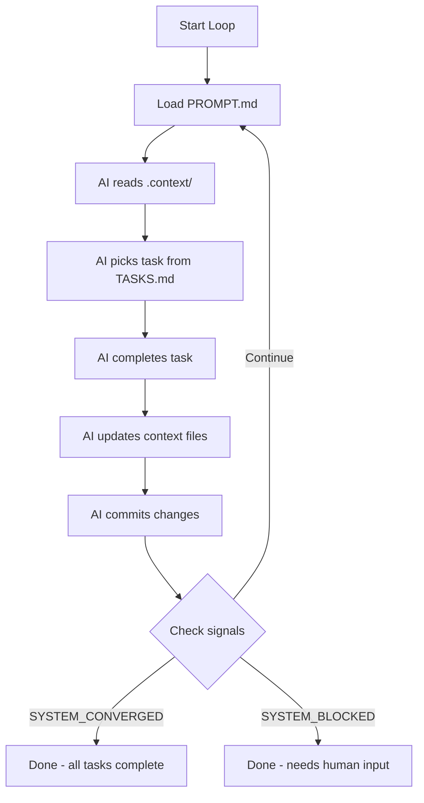

## Autonomous AI Development

*Iterate until done.*

An autonomous loop is an iterative AI development workflow where an agent works
on tasks until completion—without constant human intervention. Context (`ctx`)
provides the memory that makes this possible:

- **`ctx`** provides the *memory*: persistent context that survives across iterations
- **The loop** provides the *automation*: continuous execution until done

Together, they enable fully autonomous AI development where the agent remembers
everything across iterations.

!!! note "Origin"
    This pattern is inspired by [Geoffrey Huntley's Ralph Wiggum technique](https://ghuntley.com/ralph/).
    We use generic terminology here so the concepts remain clear regardless of trends.

## How It Works



1. Loop reads `PROMPT.md` and invokes AI
2. AI loads context from `.context/`
3. AI picks one task and completes it
4. AI updates context files (mark task done, add learnings)
5. AI commits changes
6. Loop checks for completion signals
7. Repeat until converged or blocked

## Quick Start: Shell While Loop (Recommended)

The best way to run an autonomous loop is a plain shell script that invokes
your AI tool in a fresh process on each iteration. This is "pure ralph":
the **only** state that carries between iterations is what lives in
`.context/` and the git history. No context window bleed, no accumulated
tokens, no hidden state.

Create a `loop.sh`:

```bash
#!/bin/bash
# loop.sh — an autonomous iteration loop

PROMPT_FILE="${1:-PROMPT.md}"
MAX_ITERATIONS="${2:-10}"
OUTPUT_FILE="/tmp/loop_output.txt"

for i in $(seq 1 $MAX_ITERATIONS); do
  echo "=== Iteration $i ==="

  # Invoke AI with prompt
  cat "$PROMPT_FILE" | claude --print > "$OUTPUT_FILE" 2>&1

  # Display output
  cat "$OUTPUT_FILE"

  # Check for completion signals
  if grep -q "SYSTEM_CONVERGED" "$OUTPUT_FILE"; then
    echo "Loop complete: All tasks done"
    break
  fi

  if grep -q "SYSTEM_BLOCKED" "$OUTPUT_FILE"; then
    echo "Loop blocked: Needs human input"
    break
  fi

  sleep 2
done
```

Make it executable and run:

```bash
chmod +x loop.sh
./loop.sh
```

You can also generate this script with `ctx loop` (see [CLI Reference](cli-reference.md#ctx-loop)).

### Why a Shell Loop?

Each iteration starts a **fresh AI process** with zero context window history.
The agent knows only what it reads from `.context/` files — exactly the
information you chose to persist. This is the core Ralph principle: memory is
explicit, not accidental.

## Alternative: Claude Code's Built-in Loop

Claude Code has built-in loop support:

```bash
# Start autonomous loop
/loop

# Cancel running loop
/cancel-loop
```

This is convenient for quick iterations, but be aware of important caveats:

!!! warning "Not Pure Ralph"
    Claude Code's `/loop` runs all iterations **within the same session**.
    This means:

    - **State leaks between iterations.** The context window accumulates
      output from every previous iteration. The agent "remembers" things
      it saw earlier — even if they were never persisted to `.context/`.
    - **Token budget degrades.** Each iteration adds to the context window,
      leaving less room for actual work in later iterations.
    - **Not ergonomic for long runs.** Users report that the built-in loop
      is less predictable for 10+ iteration runs compared to a shell loop.

    For short explorations (2-5 iterations) or interactive use, `/loop`
    works fine. For overnight unattended runs or anything where iteration
    independence matters, use the shell while loop instead.

## The PROMPT.md File

The prompt file instructs the AI on how to work autonomously. Here's a template:

```markdown
# Autonomous Development Prompt

You are working on this project autonomously. Follow these steps:

## 1. Load Context

Read these files in order:
1. `.context/CONSTITUTION.md` — NEVER violate these rules
2. `.context/TASKS.md` — Find work to do
3. `.context/CONVENTIONS.md` — Follow these patterns
4. `.context/DECISIONS.md` — Understand past choices

## 2. Pick One Task

From `.context/TASKS.md`, select ONE task that is:
- Not blocked
- Highest priority available
- Within your capabilities

## 3. Complete the Task

- Write code following conventions
- Run tests if applicable
- Keep changes focused and minimal

## 4. Update Context

After completing work:
- Mark task complete in TASKS.md
- Add any learnings to LEARNINGS.md
- Add any decisions to DECISIONS.md

## 5. Commit Changes

Create a focused commit with clear message.

## 6. Signal Status

End your response with exactly ONE of:

- `SYSTEM_CONVERGED` — All tasks in TASKS.md are complete
- `SYSTEM_BLOCKED` — Cannot proceed, need human input (explain why)
- (no signal) — More work remains, continue to next iteration

## Rules

- ONE task per iteration
- NEVER skip tests
- NEVER violate CONSTITUTION.md
- Commit after each task
```

## Completion Signals

The loop watches for these signals in AI output:

| Signal               | Meaning            | When to Use                              |
|----------------------|--------------------|------------------------------------------|
| `SYSTEM_CONVERGED`   | All tasks complete | No pending tasks in TASKS.md             |
| `SYSTEM_BLOCKED`     | Cannot proceed     | Needs clarification, access, or decision |
| `BOOTSTRAP_COMPLETE` | Initial setup done | Project scaffolding finished             |

### Example Usage

```markdown
I've completed all tasks in TASKS.md:
- [x] Set up project structure
- [x] Implement core API
- [x] Add authentication
- [x] Write tests

No pending tasks remain.

SYSTEM_CONVERGED
```

```markdown
I cannot proceed with the "Deploy to production" task because:
- Missing AWS credentials
- Need confirmation on region selection

Please provide credentials and confirm deployment region.

SYSTEM_BLOCKED
```

## Why Context + Loops Work Well Together

| Without ctx                 | With ctx                             |
|-----------------------------|--------------------------------------|
| Each iteration starts fresh | Each iteration has full history      |
| Decisions get re-made       | Decisions persist in DECISIONS.md    |
| Learnings are lost          | Learnings accumulate in LEARNINGS.md |
| Tasks can be forgotten      | Tasks tracked in TASKS.md            |

### Automatic Context Updates

During the loop, the AI should update context files:

**Mark task complete:**
```bash
ctx complete "implement user auth"
```

Or emit an update command (parsed by `ctx watch`):
```xml
<context-update type="complete">user auth</context-update>
```

**Add learning:**
```bash
ctx add learning "Rate limiting requires Redis connection"
```

Or via update command:
```xml
<context-update type="learning">Rate limiting requires Redis connection</context-update>
```

**Record decision:**
```bash
ctx add decision "Use JWT tokens for API authentication"
```

## Advanced: Watch Mode

Run `ctx watch` alongside the loop to automatically process context updates:

```bash
# Terminal 1: Run the loop
./loop.sh 2>&1 | tee /tmp/loop.log

# Terminal 2: Watch for context updates
ctx watch --log /tmp/loop.log
```

The watch command processes context updates from the loop output in
real time.

## Project Setup

Initialize a project for autonomous loop operation:

```bash
# Initialize with autonomous agent behavior
ctx init --ralph
```

The `--ralph` flag creates a `PROMPT.md` where the agent:

- Works autonomously without asking clarifying questions
- Follows one-task-per-iteration discipline
- Uses `SYSTEM_CONVERGED` / `SYSTEM_BLOCKED` signals

Without `--ralph`, the agent is encouraged to ask questions when requirements
are unclear — better for collaborative human-agent sessions.

## Example Project Structure

```
my-project/
├── .context/
│   ├── CONSTITUTION.md
│   ├── TASKS.md          # Work items for the loop
│   ├── DECISIONS.md
│   ├── LEARNINGS.md
│   ├── CONVENTIONS.md
│   └── sessions/         # Loop iteration history
├── PROMPT.md             # Instructions for the AI
├── IMPLEMENTATION_PLAN.md # High-level project direction
├── loop.sh               # Loop script (if not using Claude Code)
└── src/                  # Your code
```

### Sample TASKS.md for Autonomous Loops

```markdown
# Tasks

## Phase 1: Setup

- [x] Initialize project structure
- [x] Set up testing framework

## Phase 2: Core Features

- [ ] Implement user registration `#priority:high`
- [ ] Add email verification `#priority:high`
- [ ] Create password reset flow `#priority:medium`

## Phase 3: Polish

- [ ] Add rate limiting `#priority:medium`
- [ ] Improve error messages `#priority:low`
```

The loop will work through these systematically, marking each complete.

## Troubleshooting

### Loop Runs Forever

**Cause:** AI not emitting completion signals

**Fix:** Ensure PROMPT.md explicitly instructs signaling:
```markdown
End EVERY response with one of:
- SYSTEM_CONVERGED (if all tasks done)
- SYSTEM_BLOCKED (if stuck)
```

### Context Not Persisting

**Cause**: AI not updating context files

**Fix**: Add explicit instructions to PROMPT.md:
```markdown
After completing a task, you MUST:
1. Run: ctx complete "<task>"
2. Add learnings: ctx add learning "..."
```

### Tasks Getting Repeated

**Cause**: Task not marked complete before next iteration

**Fix**: Ensure commit happens after context update:
```markdown
Order of operations:
1. Complete coding work
2. Update context files (ctx complete, ctx add)
3. Commit ALL changes including .context/
4. Then signal status
```

### AI Violating Constitution

**Cause**: Constitution not read first

**Fix**: Make constitution check explicit in PROMPT.md:
```markdown
BEFORE any work:
1. Read .context/CONSTITUTION.md
2. If task would violate ANY rule, emit SYSTEM_BLOCKED
3. Explain which rule prevents the work
```

## Further Reading

- [Building ctx Using ctx](blog/2026-01-27-building-ctx-using-ctx.md) — The dogfooding story: how autonomous loops built the tool that powers them

## Resources

- [Geoffrey Huntley's Ralph Wiggum Technique](https://ghuntley.com/ralph/) — Original inspiration
- [Context CLI](cli-reference.md) — Command reference
- [Integrations](integrations.md) — Tool-specific setup
