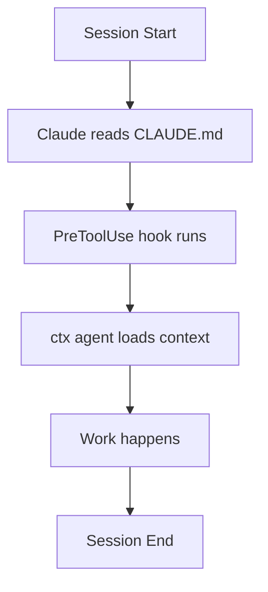

## AI Tool Integrations

Context works with any AI tool that can read files. This guide covers setup 
for popular AI coding assistants.

## Claude Code (Full Integration)

Claude Code has the deepest integration with automatic context loading.

### Automatic Setup

Running `ctx init` automatically configures Claude Code:

```bash
ctx init
```

This creates:

| File/Directory                | Purpose                |
|-------------------------------|------------------------|
| `.context/`                   | All context files      |
| `.claude/hooks/`              | Lifecycle scripts      |
| `.claude/settings.local.json` | Hook configuration     |
| `CLAUDE.md`                   | Bootstrap instructions |

### How It Works



1. **Session start**: Claude reads `CLAUDE.md`, which tells it to check `.context/`
2. **First tool use**: `PreToolUse` hook runs `ctx agent` and emits the context
   packet (subsequent invocations within the cooldown window are silent)
3. **Next session**: Claude reads context files and continues with context

### Generated Hooks

`ctx init` installs lifecycle hooks to `.claude/hooks/` and wires them
into `.claude/settings.local.json`:

| Hook | Event | Purpose |
|------|-------|---------|
| `block-non-path-ctx.sh` | PreToolUse (Bash) | Block `./ctx` or `go run` — force PATH install |
| `check-context-size.sh` | UserPromptSubmit | Nudge context assessment as sessions grow |
| `check-persistence.sh` | UserPromptSubmit | Remind to persist learnings/decisions |
| `cleanup-tmp.sh` | SessionEnd | Remove stale temp files (older than 15 days) |

A catch-all PreToolUse hook also runs `ctx agent` on every tool use
(with cooldown) to autoload context.

### Generated Configuration

`.claude/settings.local.json`:

```json
{
  "hooks": {
    "PreToolUse": [
      {
        "matcher": ".*",
        "hooks": [
          {
            "type": "command",
            "command": "ctx agent --budget 4000 --session $PPID 2>/dev/null || true"
          }
        ]
      }
    ]
  }
}
```

### Customizing Token Budget and Cooldown

Edit the PreToolUse command to change the token budget or cooldown:

```text
"command": "ctx agent --budget 8000 --session $PPID 2>/dev/null || true"
"command": "ctx agent --budget 4000 --cooldown 5m --session $PPID 2>/dev/null || true"
```

The `--session $PPID` flag isolates the cooldown per session — `$PPID` resolves
to the Claude Code process PID, so concurrent sessions don't interfere.
The default cooldown is 10 minutes; use `--cooldown 0` to disable it.

### Verifying Setup

1. Start a new Claude Code session
2. Ask: **"Do you remember?"**
3. Claude should cite specific context:
   * Current tasks from `.context/TASKS.md`
   * Recent decisions or learnings
   * Recent session history from `ctx recall`

### Troubleshooting

| Issue                | Solution                                                   |
|----------------------|------------------------------------------------------------|
| Context not loading  | Check `ctx` is in PATH: `which ctx`                        |
| Hook errors          | Check script permissions: `chmod +x .claude/hooks/*.sh`    |

### Manual Context Load

If hooks aren't working, manually load context:

```bash
# Get context packet
ctx agent --budget 4000

# Or paste into conversation
cat .context/TASKS.md
```

### Agent Skills

`ctx init` installs Agent Skills to `.claude/skills/` following the
[agentskills.io specification](https://agentskills.io). These are invoked
in Claude Code with `/skill-name`.

#### Context Skills

| Skill          | Description                                        |
|----------------|----------------------------------------------------|
| `/ctx-status`  | Show context summary (tasks, decisions, learnings) |
| `/ctx-agent`   | Get AI-optimized context packet                    |
| `/ctx-drift`           | Detect and fix context drift (structural + semantic) |
| `/ctx-alignment-audit` | Audit doc claims against playbook instructions       |
| `/ctx-reflect` | Review session and suggest what to persist         |

#### Context Persistence Skills

| Command             | Description                                        |
|---------------------|----------------------------------------------------|
| `/ctx-add-task`       | Add a task to TASKS.md                             |
| `/ctx-add-learning`   | Add a learning to LEARNINGS.md                     |
| `/ctx-add-decision`   | Add a decision with context/rationale/consequences |
| `/ctx-add-convention` | Add a coding convention to CONVENTIONS.md          |
| `/ctx-archive`        | Archive completed tasks                            |

#### Session History Skills

| Command                  | Description                                     |
|--------------------------|-------------------------------------------------|
| `/ctx-recall`            | Browse AI session history                       |
| `/ctx-journal-enrich`    | Enrich a journal entry with frontmatter/tags    |
| `/ctx-journal-enrich-all`| Batch-enrich all unenriched journal entries     |

#### Blogging Skills

!!! tip "Blogging is a Better Way of Creating Release Notes"
    The blogging workflow can also double as generating release notes:

    AI reads your git commit history and creates a "*narrative*",
    which is essentially what a *release note* is for.

| Command               | Description                                     |
|-----------------------|-------------------------------------------------|
| `/ctx-blog`           | Generate blog post from recent activity         |
| `/ctx-blog-changelog` | Generate blog post from commit range with theme |

#### Development Skills

| Command             | Description                            |
|---------------------|----------------------------------------|
| `/ctx-loop`         | Generate a Ralph Loop iteration script |
| `/ctx-prompt-audit` | Analyze session logs for vague prompts |

#### Usage Examples

```text
/ctx-status
/ctx-add-learning "Token refresh requires explicit cache invalidation"
/ctx-journal-enrich twinkly-stirring-kettle
```

Skills support partial matching where applicable (e.g., session slugs).

---

## Cursor IDE

Cursor can use context files through its system prompt or by reading 
files directly.

### Setup

```bash
# Generate Cursor configuration
ctx hook cursor

# Initialize context
ctx init --minimal
```

### Configuration

Add to Cursor settings (`.cursor/settings.json`):

```text
// split to multiple lines for readability
{
  "ai.systemPrompt": "Read .context/TASKS.md and 
  .context/CONVENTIONS.md before responding. 
  Follow rules in .context/CONSTITUTION.md.",
}
```

### Usage

1. Open your project in Cursor
2. Context files are available in the file tree
3. Reference them in prompts: 
   "Check .context/DECISIONS.md for our approach to..."

### Manual Context Injection

For more control, paste context directly:

```bash
# Get AI-ready packet
ctx agent --budget 4000 | pbcopy  # macOS
ctx agent --budget 4000 | xclip  # Linux
```

Paste into Cursor's chat.

---

## Aider

Aider works well with context files through its `--read` flag.

### Setup

```bash
# Generate Aider configuration
ctx hook aider

# Initialize context
ctx init
```

### Configuration

Create `.aider.conf.yml`:

```yaml
read:
  - .context/CONSTITUTION.md
  - .context/TASKS.md
  - .context/CONVENTIONS.md
  - .context/DECISIONS.md
```

### Usage

```bash
# Start Aider (reads context files automatically)
aider

# Or specify files explicitly
aider --read .context/TASKS.md --read .context/CONVENTIONS.md
```

### With Watch Mode

Run `ctx watch` alongside Aider to capture context updates:

```bash
# Terminal 1: Run Aider
aider 2>&1 | tee /tmp/aider.log

# Terminal 2: Watch for context updates
ctx watch --log /tmp/aider.log
```

---

## GitHub Copilot

Copilot reads open files for context. Keep context files open or reference 
them in comments.

### Setup

```bash
# Generate Copilot tips
ctx hook copilot

# Initialize context
ctx init --minimal
```

### Usage Patterns

**Pattern 1: Keep context files open**

Open `.context/CONVENTIONS.md` in a split pane. Copilot will reference it.

**Pattern 2: Reference in comments**

```typescript
// See .context/CONVENTIONS.md for naming patterns
// Following decision in .context/DECISIONS.md: Use PostgreSQL

function getUserById(id: string) {
  // Copilot now has context
}
```

**Pattern 3: Paste context into Copilot Chat**

```bash
ctx agent --budget 2000
```

Paste output into Copilot Chat for context-aware responses.

---

## Windsurf IDE

Windsurf supports custom instructions and file-based context.

### Setup

```bash
# Generate Windsurf configuration
ctx hook windsurf

# Initialize context
ctx init
```

### Configuration

Add to Windsurf settings:

```text
// Split to multiple lines for readability
{
  "ai.customInstructions": "Always read .context/CONSTITUTION.md first. 
  Check .context/TASKS.md for current work. 
  Follow patterns in .context/CONVENTIONS.md."
}
```

### Usage

Context files appear in the file tree. Reference them when chatting:

* "What's in our task list?" → AI reads `.context/TASKS.md`
* "What convention do we use for naming?" → AI reads `.context/CONVENTIONS.md`

---

## Generic Integration

For any AI tool that can read files, use these patterns:

### Manual Context Loading

```bash
# Get full context
ctx load

# Get AI-optimized packet
ctx agent --budget 8000

# Get specific file
cat .context/TASKS.md
```

### System Prompt Template

```
You are working on a project with persistent context in .context/

Before responding:
1. Read .context/CONSTITUTION.md - NEVER violate these rules
2. Check .context/TASKS.md for current work
3. Follow .context/CONVENTIONS.md patterns
4. Reference .context/DECISIONS.md for architectural choices

When you learn something new, note it for .context/LEARNINGS.md
When you make a decision, document it for .context/DECISIONS.md
```

### Automated Updates

If your AI tool outputs to a log, use `ctx watch`:

```bash
# Watch log file for context-update commands
your-ai-tool 2>&1 | tee /tmp/ai.log &
ctx watch --log /tmp/ai.log
```

The AI can emit updates like:

```xml
<context-update type="learning">Important thing learned today</context-update>
<context-update type="complete">implement caching</context-update>
```

---

## Context Update Commands

The `ctx watch` command parses update commands from AI output. Use this format:

```text
<context-update type="TYPE" [attributes]>Content</context-update>
```

### Supported Types

| Type         | Target File    | Required Attributes                           |
|--------------|----------------|-----------------------------------------------|
| `task`       | TASKS.md       | None                                          |
| `decision`   | DECISIONS.md   | `context`, `rationale`, `consequences`        |
| `learning`   | LEARNINGS.md   | `context`, `lesson`, `application`            |
| `convention` | CONVENTIONS.md | None                                          |
| `complete`   | TASKS.md       | None                                          |

### Simple Format (tasks, conventions, complete)

```xml
<context-update type="task">Implement rate limiting</context-update>
<context-update type="convention">Use kebab-case for files</context-update>
<context-update type="complete">rate limiting</context-update>
```

### Structured Format (learnings, decisions)

Learnings and decisions support structured attributes for better documentation:

**Learning with full structure**:

```xml
<context-update type="learning"
  context="Debugging Claude Code hooks"
  lesson="Hooks receive JSON via stdin, not environment variables"
  application="Use jq to parse: COMMAND=$(echo $INPUT | jq -r .tool_input.command)"
>Hook Input Format</context-update>
```

**Decision with full structure**:

```xml
<context-update type="decision"
  context="Need a caching layer for API responses"
  rationale="Redis is fast, well-supported, and team has experience"
  consequences="Must provision Redis infrastructure; team training on Redis patterns"
>Use Redis for caching</context-update>
```

Learnings require: `context`, `lesson`, `application` attributes.
Decisions require: `context`, `rationale`, `consequences` attributes.
Updates missing required attributes are rejected with an error.

## Further Reading

- [Skills That Fight the Platform](blog/2026-02-04-skills-that-fight-the-platform.md) — Common pitfalls in skill design that work against the host tool
- [The Anatomy of a Skill That Works](blog/2026-02-07-the-anatomy-of-a-skill-that-works.md) — What makes a skill reliable: the E/A/R framework and quality gates

### Usage with ctx watch

```bash
# Pipe AI output through watch
your-ai-tool | ctx watch

# Or watch a log file
ctx watch --log /tmp/ai-output.log

# Preview without applying
ctx watch --dry-run
```
