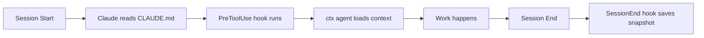

# AI Tool Integrations

Context works with any AI tool that can read files. This guide covers setup 
for popular AI coding assistants.

## Claude Code (Full Integration)

Claude Code has the deepest integration with automatic context loading and 
session persistence.

### Automatic Setup

Running `ctx init` automatically configures Claude Code:

```bash
ctx init
```

This creates:

| File/Directory                | Purpose                |
|-------------------------------|------------------------|
| `.context/`                   | All context files      |
| `.claude/hooks/`              | Auto-save scripts      |
| `.claude/settings.local.json` | Hook configuration     |
| `CLAUDE.md`                   | Bootstrap instructions |

### How It Works



1. **Session start**: Claude reads `CLAUDE.md`, which tells it to check `.context/`
2. **During session**: `PreToolUse` hook runs `ctx agent --budget 4000` 
   before each tool use
3. **Session end**: `SessionEnd` hook saves context snapshot to `.context/sessions/`
4. **Next session**: Claude sees previous sessions and continues with context

### Generated Configuration

`.claude/settings.local.json`:

```json
{
  "hooks": {
    "PreToolUse": [
      {
        "matcher": ".*",
        "hooks": [
          {
            "type": "command",
            "command": "ctx agent --budget 4000 2>/dev/null || true"
          }
        ]
      }
    ],
    "SessionEnd": [
      {
        "hooks": [
          {
            "type": "command",
            "command": ".claude/hooks/auto-save-session.sh"
          }
        ]
      }
    ]
  }
}
```

### Customizing Token Budget

Edit the PreToolUse command to change the token budget:

```json
"command": "ctx agent --budget 8000 2>/dev/null || true"
```

### Verifying Setup

1. Start a new Claude Code session
2. Ask: **"Do you remember?"**
3. Claude should cite specific context:
   - Current tasks from `.context/TASKS.md`
   - Recent decisions or learnings
   - Previous session topics from `.context/sessions/`

### Troubleshooting

| Issue                | Solution                                                   |
|----------------------|------------------------------------------------------------|
| Context not loading  | Check `ctx` is in PATH: `which ctx`                        |
| No sessions saved    | Verify `.claude/settings.local.json` has `SessionEnd` hook |
| Hook errors          | Check script permissions: `chmod +x .claude/hooks/*.sh`    |
| Missing sessions dir | Create it: `mkdir -p .context/sessions`                    |

### Manual Context Load

If hooks aren't working, manually load context:

```bash
# Get context packet
ctx agent --budget 4000

# Or paste into conversation
cat .context/TASKS.md
```

---

## Cursor IDE

Cursor can use context files through its system prompt or by reading 
files directly.

### Setup

```bash
# Generate Cursor configuration
ctx hook cursor

# Initialize context
ctx init --minimal
```

### Configuration

Add to Cursor settings (`.cursor/settings.json`):

```json
{
  "ai.systemPrompt": "Read .context/TASKS.md and .context/CONVENTIONS.md before responding. Follow rules in .context/CONSTITUTION.md.",
}
```

### Usage

1. Open your project in Cursor
2. Context files are available in the file tree
3. Reference them in prompts: 
   "Check .context/DECISIONS.md for our approach to..."

### Manual Context Injection

For more control, paste context directly:

```bash
# Get AI-ready packet
ctx agent --budget 4000 | pbcopy  # macOS
ctx agent --budget 4000 | xclip  # Linux
```

Paste into Cursor's chat.

---

## Aider

Aider works well with context files through its `--read` flag.

### Setup

```bash
# Generate Aider configuration
ctx hook aider

# Initialize context
ctx init
```

### Configuration

Create `.aider.conf.yml`:

```yaml
read:
  - .context/CONSTITUTION.md
  - .context/TASKS.md
  - .context/CONVENTIONS.md
  - .context/DECISIONS.md
```

### Usage

```bash
# Start Aider (reads context files automatically)
aider

# Or specify files explicitly
aider --read .context/TASKS.md --read .context/CONVENTIONS.md
```

### With Watch Mode

Run `ctx watch` alongside Aider to capture context updates:

```bash
# Terminal 1: Run Aider
aider 2>&1 | tee /tmp/aider.log

# Terminal 2: Watch for context updates
ctx watch --log /tmp/aider.log
```

---

## GitHub Copilot

Copilot reads open files for context. Keep context files open or reference 
them in comments.

### Setup

```bash
# Generate Copilot tips
ctx hook copilot

# Initialize context
ctx init --minimal
```

### Usage Patterns

**Pattern 1: Keep context files open**

Open `.context/CONVENTIONS.md` in a split pane. Copilot will reference it.

**Pattern 2: Reference in comments**

```typescript
// See .context/CONVENTIONS.md for naming patterns
// Following decision in .context/DECISIONS.md: Use PostgreSQL

function getUserById(id: string) {
  // Copilot now has context
}
```

**Pattern 3: Paste context into Copilot Chat**

```bash
ctx agent --budget 2000
```

Paste output into Copilot Chat for context-aware responses.

---

## Windsurf IDE

Windsurf supports custom instructions and file-based context.

### Setup

```bash
# Generate Windsurf configuration
ctx hook windsurf

# Initialize context
ctx init
```

### Configuration

Add to Windsurf settings:

```json
{
  "ai.customInstructions": "Always read .context/CONSTITUTION.md first. Check .context/TASKS.md for current work. Follow patterns in .context/CONVENTIONS.md."
}
```

### Usage

Context files appear in the file tree. Reference them when chatting:

- "What's in our task list?" → AI reads `.context/TASKS.md`
- "What convention do we use for naming?" → AI reads `.context/CONVENTIONS.md`

---

## Generic Integration

For any AI tool that can read files, use these patterns:

### Manual Context Loading

```bash
# Get full context
ctx load

# Get AI-optimized packet
ctx agent --budget 8000

# Get specific file
cat .context/TASKS.md
```

### System Prompt Template

```
You are working on a project with persistent context in .context/

Before responding:
1. Read .context/CONSTITUTION.md - NEVER violate these rules
2. Check .context/TASKS.md for current work
3. Follow .context/CONVENTIONS.md patterns
4. Reference .context/DECISIONS.md for architectural choices

When you learn something new, note it for .context/LEARNINGS.md
When you make a decision, document it for .context/DECISIONS.md
```

### Automated Updates

If your AI tool outputs to a log, use `ctx watch`:

```bash
# Watch log file for context-update commands
your-ai-tool 2>&1 | tee /tmp/ai.log &
ctx watch --log /tmp/ai.log
```

The AI can emit updates like:

```xml
<context-update type="learning">Important thing learned today</context-update>
<context-update type="complete">implement caching</context-update>
```

---

## Context Update Commands

The `ctx watch` command parses update commands from AI output. Use this format:

```xml
<context-update type="TYPE">Content</context-update>
```

### Supported Types

| Type         | Target File    | Example                                                                       |
|--------------|----------------|-------------------------------------------------------------------------------|
| `task`       | TASKS.md       | `<context-update type="task">Implement caching</context-update>`              |
| `decision`   | DECISIONS.md   | `<context-update type="decision">Use Redis for caching</context-update>`      |
| `learning`   | LEARNINGS.md   | `<context-update type="learning">Mocks must be hoisted</context-update>`      |
| `convention` | CONVENTIONS.md | `<context-update type="convention">Use kebab-case for files</context-update>` |
| `complete`   | TASKS.md       | `<context-update type="complete">user auth</context-update>`                  |

### Examples

**Add a task:**

```xml
<context-update type="task">Implement rate limiting</context-update>
```

**Record a decision:**

```xml
<context-update type="decision">Use PostgreSQL for primary database</context-update>
```

**Note a learning:**

```xml
<context-update type="learning">Mock functions must be hoisted in Vitest</context-update>
```

**Complete a task (by partial match):**

```xml
<context-update type="complete">rate limiting</context-update>
```

### Usage with ctx watch

```bash
# Pipe AI output through watch
your-ai-tool | ctx watch

# Or watch a log file
ctx watch --log /tmp/ai-output.log

# Preview without applying
ctx watch --dry-run
```
