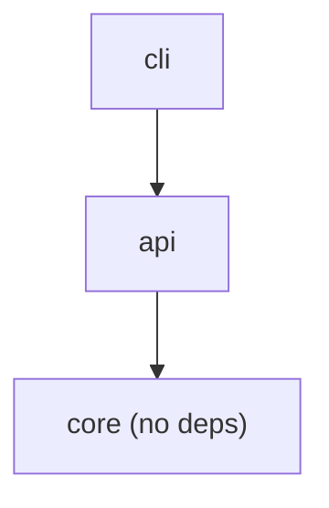
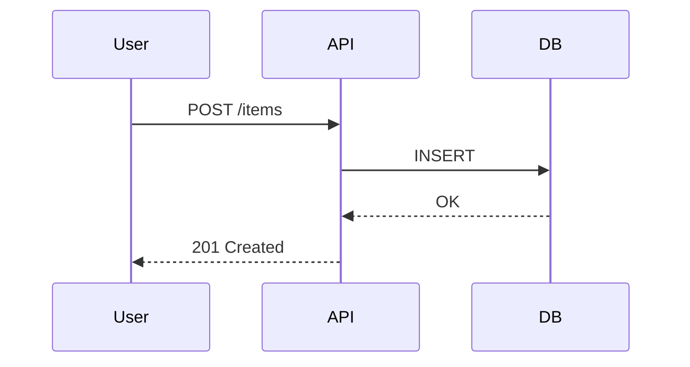

# Architecture

<!--
UPDATE WHEN:
- New components or services are added
- Components are removed or merged
- Data flow between components changes
- External dependencies or integrations change
- Deployment topology changes

DO NOT UPDATE FOR:
- Internal implementation details (use code comments)
- Minor refactoring that doesn't change boundaries
- Bug fixes within existing components

TIP: `ctx drift` scans this file for backtick-enclosed paths
and warns if they do not exist on disk. Keep paths accurate.
-->

## Overview

<!-- What does this system do? What is the design philosophy? -->

## Package/Module Dependency Graph

<!-- Use a mermaid graph to show how packages depend on each other.
     Example:


-->

## Component Map

<!-- Table of packages/modules with purpose and dependencies.
     Example:

| Package | Purpose | Key Files | Depends On |
|---------|---------|-----------|------------|
| `src/core/` | Domain logic | `models.py`, `rules.py` | (none) |
| `src/api/` | HTTP handlers | `routes.py`, `auth.py` | `core` |
-->

## Data Flow

<!-- Mermaid sequence diagrams for the 3-5 most important flows.
     Example:


-->

## Key Patterns

<!-- Architectural patterns and conventions. Examples:
     - Authentication strategy
     - Error handling approach
     - Configuration hierarchy
     - Plugin/extension points
-->

## File Layout

<!-- ASCII tree showing project structure. Example:

```
project/
├── src/
│   ├── core/        # Domain logic
│   ├── api/         # HTTP layer
│   └── cli/         # CLI entry point
├── tests/
├── docs/
└── config/
```
-->
